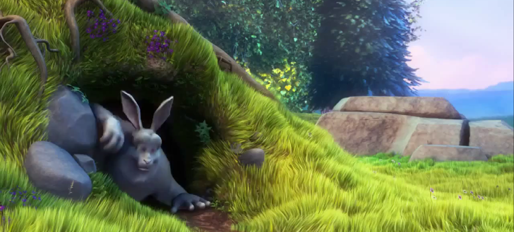

# Clip Splitter with Audio Generation

This is a Streamlit app that allows users to upload a video file, split it into multiple clips, generate audio based on a text prompt, and add the generated audio to a selected clip. The app uses the [Riffusion](https://github.com/riffusion/riffusion-hobby) model to generate audio from text prompts. The app is dockerized using Dockerfile. 


## Prerequisites

- [Docker](https://docs.docker.com/get-docker/)
- Python 3.9 or later (for development)


## Installation

As the app is dockerized, you can run it using the following steps:

1. Clone the repository:

```bash
git clone https://github.com/chewnusi/audio-generator.git
```
2. Change the directory:
```bash
cd audio-generator
```
3. Run the app using Docker:
```bash
docker build -t streamlit-audio-app .
docker run -p 8501:8501 streamlit-audio-app
```
4. Open the app in your browser by navigating to `http://localhost:8501`.

## About Dockerfile

The Dockerfile contains the following steps:
- Use the `python:3.9-slim` image as the base image.
- Install the required dependencies (Python 3, ffmpeg).
- Clone the [Riffusion](https://github.com/riffusion/riffusion-hobby)
- Copy the `app.py` and `requirements.txt` files to the `/app/riffusion/riffusion/streamlit/` directory.
- Install the required dependencies using `pip`.
- Modify the `spectrogram_converter.py` file to disable the `max_iter`, `tolerance_loss`, `tolerance_change`, and `sgdargs` parameters.
- Expose port 8501.
- Run the Streamlit app using the `venv` environment.

## Usage

1. Upload a video file (max size: 200MB).
2. Select the number of clips to split the video into (min duration: 1 second; max duration: 10 seconds).
3. Enter the number of columns to display the clips (if the number of clips is less than 3, the default number of columns is 1; else, the default number of columns is 3).
4. Enter a text prompt for generating the audio (reqired).
5. Enter a negative prompt to avoid certain outputs (optional).
6. Enter other additional parameters such as seed, inference steps, guidance, scheduler, and use 20kHz (optional).
7. Click the "Split video and Generate audio" button.
8. The app will split the video into clips, generate audio based on the text prompt, and add the generated audio to the selected clip.
9. The generated clips will be displayed and the link will be provided to download all clips as a ZIP file.


## Functionality overview

The app consists of the following functions:
- `split_video`: Split the video into the specified number of clips.
- `generate_audio`: Generate audio based on the provided inputs and parameters.
- `add_audio_to_clip`: Add the generated audio to the specified video clip.
- `convert_duration_to_ms`: Convert duration from seconds to milliseconds and round up to the nearest multiple of 8.
- `create_zip`: Create a ZIP file containing the provided video clips.
- `upload_video_file`: Allow the user to upload a video file and validate its size.
- `select_device`: Allow the user to select the compute device to use (CPU, CUDA, MPS).
- `select_clip_count`: Allow the user to select the number of clips to split the video into.
- `select_clip_for_audio`: Allow the user to select which clip to add the generated audio track to.
- `select_column_count`: Allow the user to select the number of columns to display the clips.
- `main`: Main function to run the app.


## Results

Full results can be found in the `results/clips.zip` archive. Here is a GIF showing the app in action:


[](https://github.com/chewnusi/audio-generator/blob/master/results/clip_1_with_audio.mp4)


